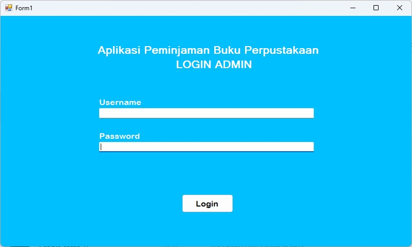
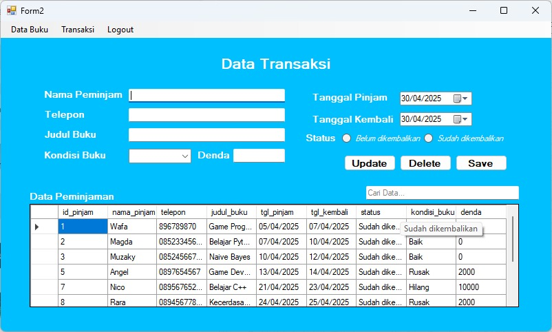
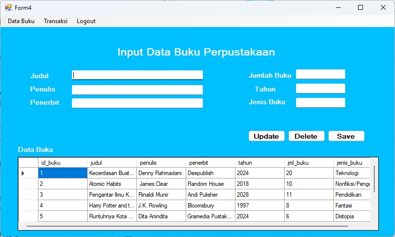

# tugaspemrogramanvisual
2213020037 - Febriyanti Nur Fadillah

Halaman Login

Data Transaksi

Input Data Buku Perpustakaan

# Aplikasi Peminjaman Buku Perpustakaan 
merupakan sistem yang dirancang untuk membantu admin dalam mengelola data peminjaman buku di perpustakaan. Aplikasi ini memiliki antarmuka login khusus untuk admin, di mana pengguna harus memasukkan username dan password untuk mengakses sistem. 
# Setelah berhasil login, 
admin akan diarahkan ke halaman Transaksi yang menyediakan berbagai kolom seperti Nama Peminjam, Telepon, Judul Buku, Tanggal Pinjam, Tanggal Kembali, Status(Belum dikembalikan atau Sudah dikembalikan), Kondisi Buku (Baik, Rusak, Hilang), dan Denda (0, 2000, 10000). Selain itu, terdapat fitur untuk menyimpan, mengedit, menghapus dan menambahkan data buku, serta area tampilan data yang memungkinkan admin melihat atau memantau daftar buku serta Search data dari Nama Peminjam atau Judul Buku yang telah terdaftar dalam sistem. 

Aplikasi ini juga dilengkapi dengan menu navigasi yang memudahkan perpindahan antar halaman, seperti Data buku, Transaksi, dan Logout. Dengan tampilan yang sederhana dan fungsional, aplikasi ini bertujuan untuk meningkatkan efisiensi dalam pengelolaan perpustakaan.

