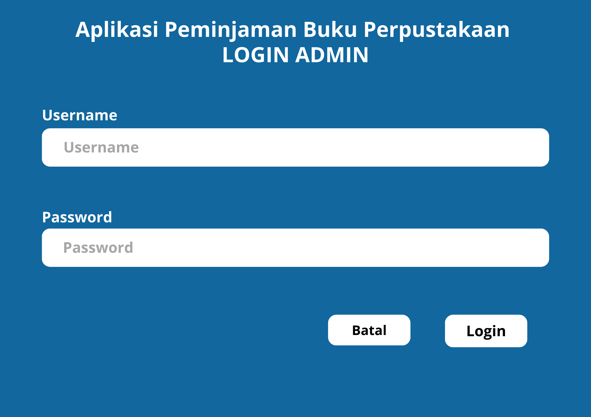
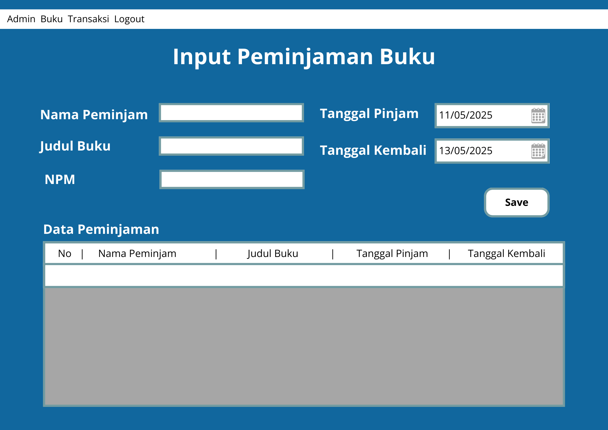
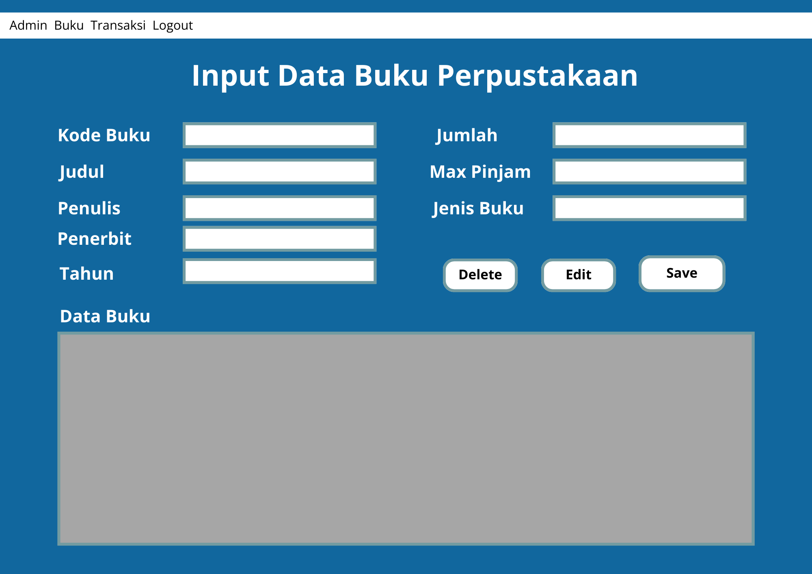
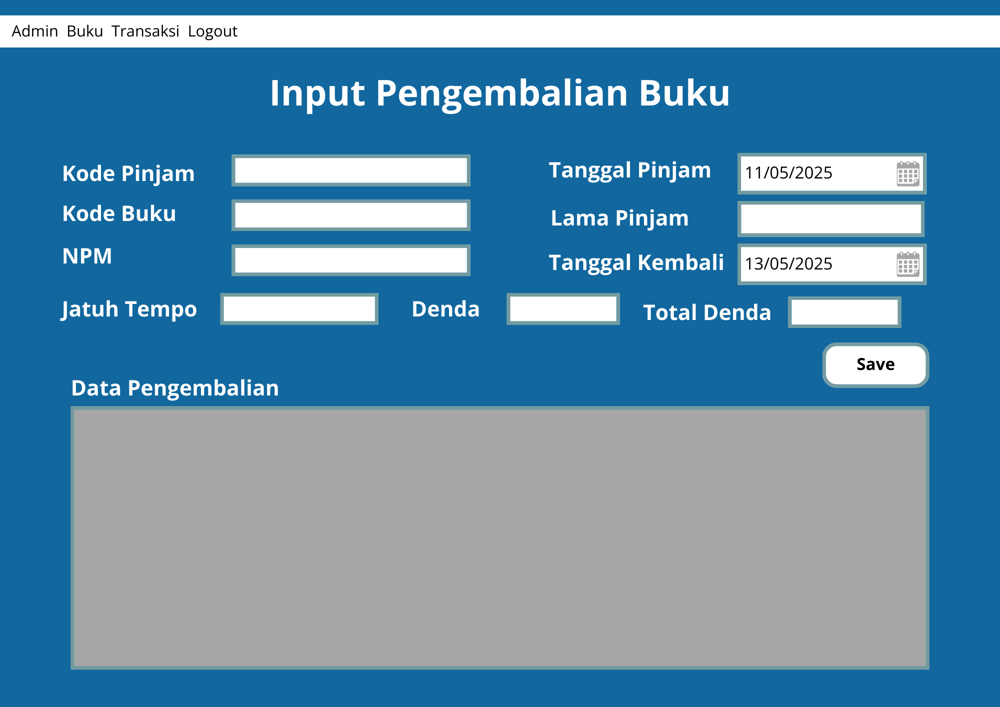

# tugaspemrogramanvisual
2213020037 - Febriyanti Nur Fadillah

Halaman Login

Input Data Buku

Input Peminjaman Buku

Input Pengembalian

Aplikasi Peminjaman Buku Perpustakaan merupakan sistem yang dirancang untuk membantu admin dalam mengelola data peminjaman buku di perpustakaan. Aplikasi ini memiliki antarmuka login khusus untuk admin, di mana pengguna harus memasukkan username dan password untuk mengakses sistem. Setelah berhasil login, admin akan diarahkan ke halaman input data buku yang menyediakan berbagai kolom seperti Kode Buku, Judul, Penulis, Penerbit, Tahun, Jumlah, Max Pinjam, dan Jenis Buku. Selain itu, terdapat fitur untuk menyimpan, mengedit, dan menghapus data buku, serta area tampilan data yang memungkinkan admin melihat atau memantau daftar buku yang telah terdaftar dalam sistem. Aplikasi ini juga dilengkapi dengan menu navigasi yang memudahkan perpindahan antar halaman, seperti halaman admin, buku, transaksi, dan logout. Dengan tampilan yang sederhana dan fungsional, aplikasi ini bertujuan untuk meningkatkan efisiensi dalam pengelolaan perpustakaan.

